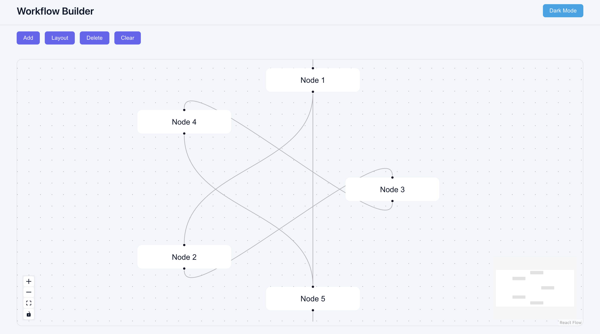

Visual Workflow Builder

A simple visual workflow editor built using React and React Flow.

This project allows users to create nodes, connect them, edit labels, and organize workflows using different layout styles. It was built to better understand how graph-based UIs work and how node positioning affects rendering.

⸻

Features
	•	Add and delete nodes dynamically
	•	Connect nodes with edges
	•	Edit node labels inline
	•	Switch between light and dark themes
	•	Apply different layout styles:
	•	Vertical
	•	Horizontal
	•	Circular
	•	Automatic saving using localStorage

  ## Preview

  

⸻

Tech Stack
	•	React
	•	React Flow (@xyflow/react)
	•	Vite
	•	CSS

⸻

Layout Implementation

The layouts in this project are implemented manually instead of relying on external graph layout libraries.
	•	Vertical Layout positions nodes with consistent vertical spacing.
	•	Horizontal Layout aligns nodes in a row with fixed horizontal gaps.
	•	Circular Layout distributes nodes evenly using trigonometric positioning (sine and cosine).

This helped in understanding how coordinate systems and positioning work inside graph-based interfaces.
