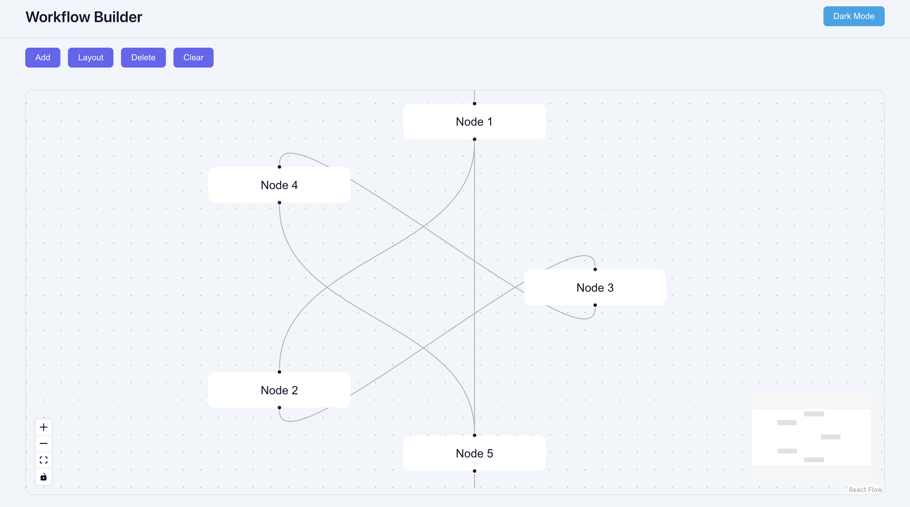

# Visual Workflow Builder

A visual workflow editor built with **React** and **React Flow**. Create workflows on a canvas, save them as JSON, and simulate how they would run step by step.

---

## Preview

<p align="center">
  
</p>

---

## Features

- **Drag-and-drop canvas** — add nodes, connect edges, zoom and pan
- **DAG validation** — blocks cycles when you connect nodes
- **Typed nodes** — Start, Process, Decision, End
- **Properties panel** — edit labels, descriptions, duration, and conditions
- **Save & load** — export/import JSON, auto-save to browser storage
- **Undo / Redo** — `Ctrl+Z` and `Ctrl+Y`
- **Run simulator** — executes the workflow in order with live highlights and logs
- **Themes & layouts** — light/dark mode, vertical, horizontal, and circular layouts

---

## Tech stack

React · React Flow · Vite · CSS

---

## Getting started

```bash
git clone https://github.com/akriti311/visual-workflow-builder.git
cd visual-workflow-builder
npm install
npm run dev
```

Open the URL shown in the terminal (usually `http://localhost:5173`).

---

## How to use

1. Click **Add Node** and pick a type (Start, Process, Decision, End).
2. Connect nodes by dragging from the bottom handle to another node's top handle.
3. Click a node to edit it in the **Properties** panel on the right.
4. Click **Run** to simulate the workflow. Watch nodes highlight and check the **Execution Log**.
5. Use **Export** / **Import** to save or load workflows as JSON files.

### Quick example

Build a simple flow: **Start → Process → End**, then click **Run**.

For a Decision node, set a condition like `stock > 0` — the simulator picks the True or False branch.

---

## Project structure

```
src/
├── graph/        # DAG validation, topological sort
├── engine/       # Workflow execution
├── persistence/  # JSON save/load
├── hooks/        # App state
└── components/   # UI (canvas, nodes, panels)
```

---

## Author

**Akriti Agrawal** — [GitHub](https://github.com/akriti311)
